# Mega 2560+

Mega 2560+ is an upgraded version of the Arduino Mega 2560. It keeps the same form factor and pinout as the original so it still drops into every Mega shield, but it adds an onboard sensor suite and an ESP32-S3 co-processor for WiFi, Bluetooth, and sensor reading.

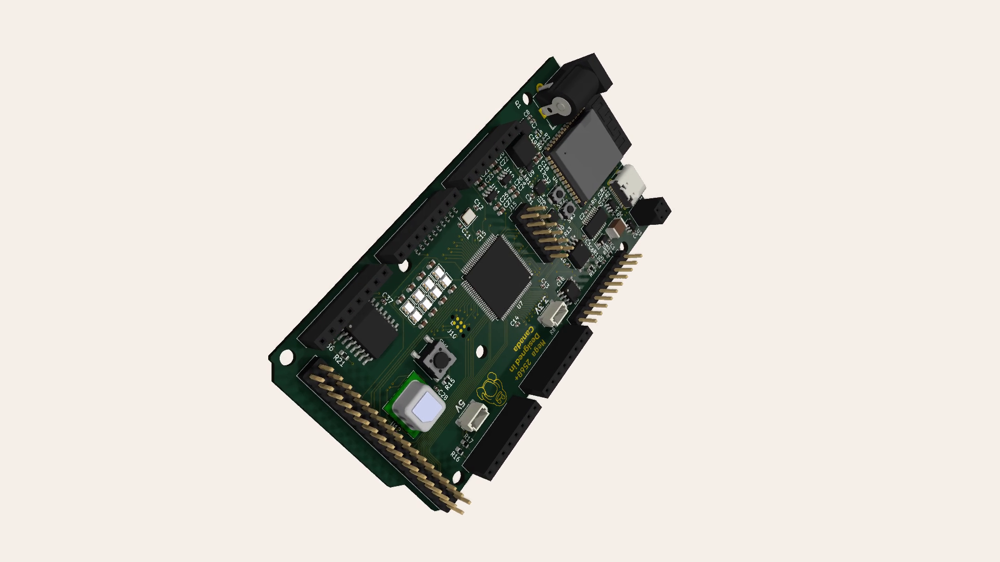

## Why I made it

I kept reaching for a Mega plus a pile of breakout boards — a CO2 sensor here, an IMU there, a WiFi module taped on somewhere. It was messy and fragile. I wanted a single board I can just drop into a project that already knows the room around it: temperature, humidity, air quality, CO2, and motion. And since everything talks to the network these days, an ESP32-S3 handles the WiFi/Bluetooth so the Mega can focus on running the actual project.

## Key Features

- ATmega2560-16A main MCU (same chip as the original Mega)
- ESP32-S3-WROOM-1U co-processor with 16MB flash / 8MB PSRAM for WiFi and Bluetooth
- Onboard sensor suite:
  - SCD41 CO2 sensor
  - BME680 temp / humidity / pressure / air quality
  - LSM6DSL 6-axis IMU
- DS3231M RTC with battery backup (CR2032)
- FM24C64C FRAM and W25Q128JVS SPI flash for storage
- USB-C with FT231XS USB-UART and ESD protection
- WS2812B-2020 addressable status LEDs
- TPS62163 buck + TLV75733 LDO power section, barrel jack or battery input with reverse polarity protection
- Drop-in Mega pinout — compatible with existing Mega shields

## Images

### PCB Layout

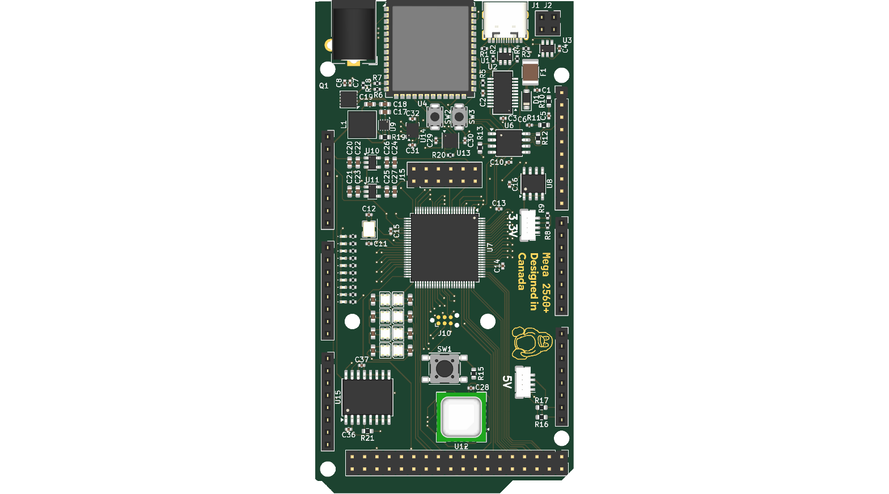

### Schematic

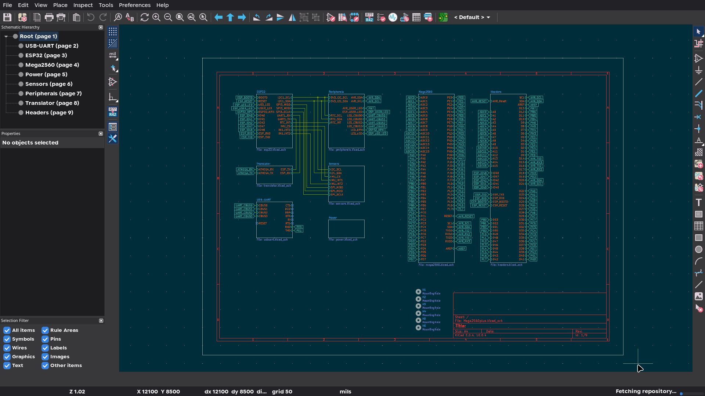

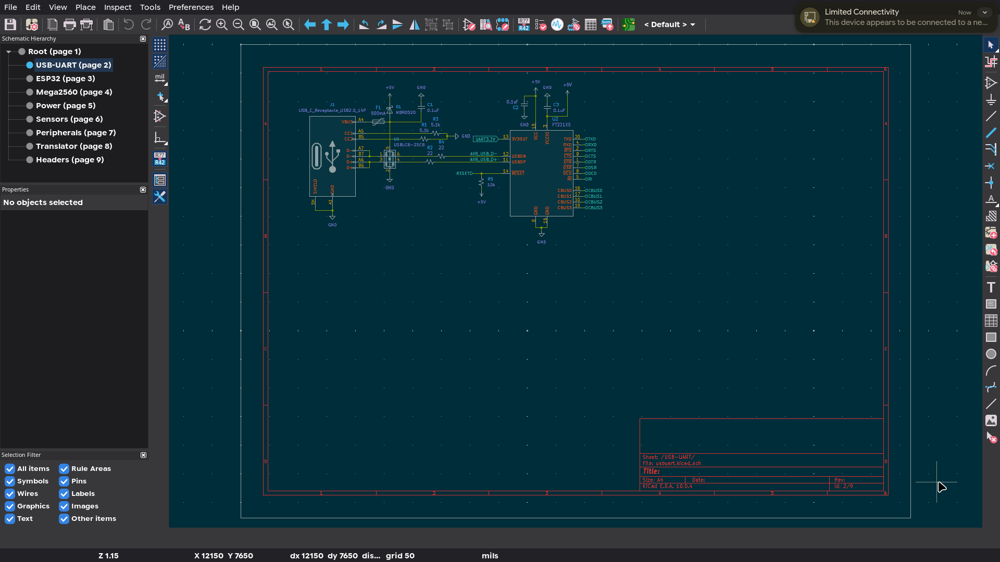
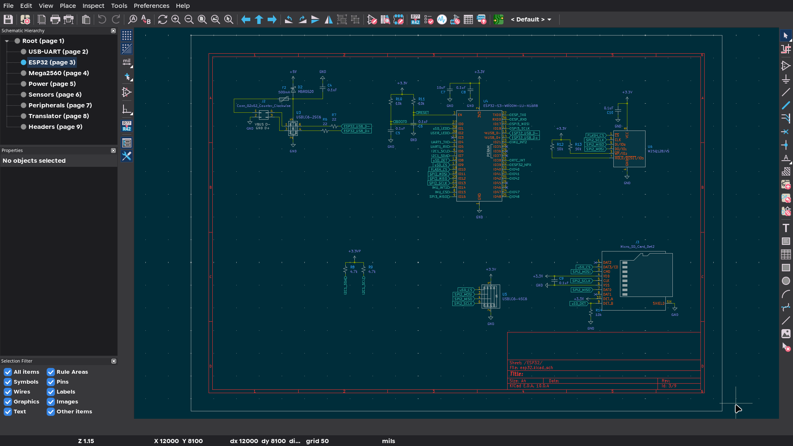
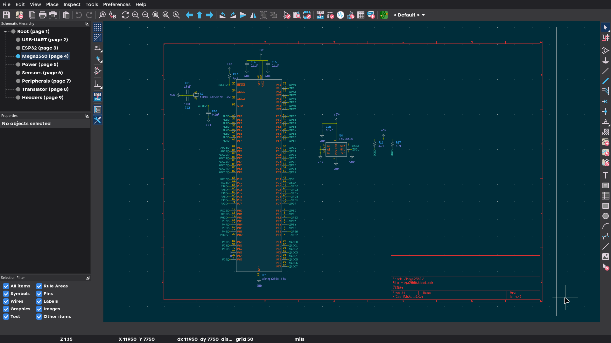
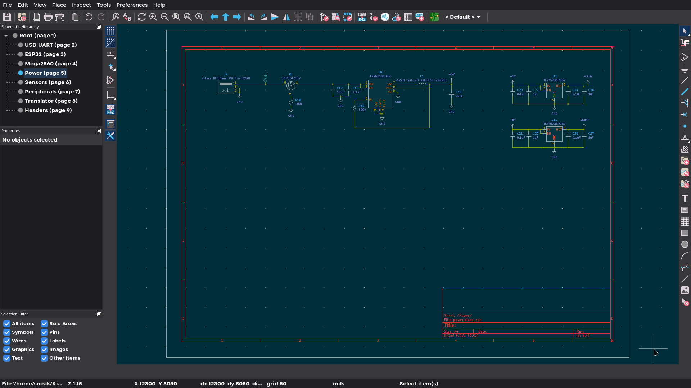
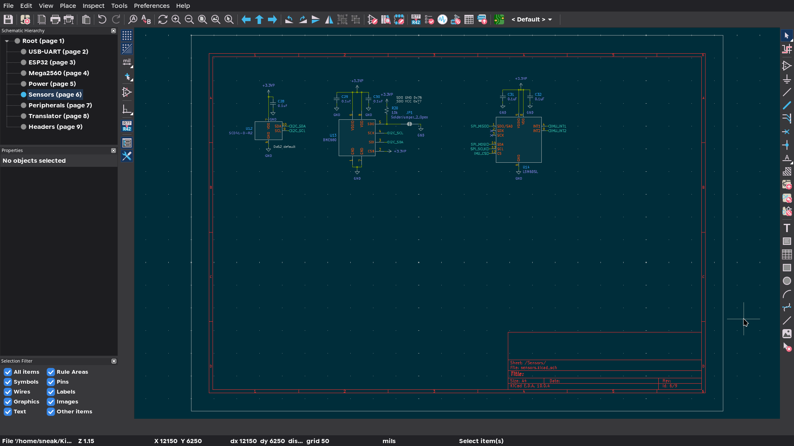
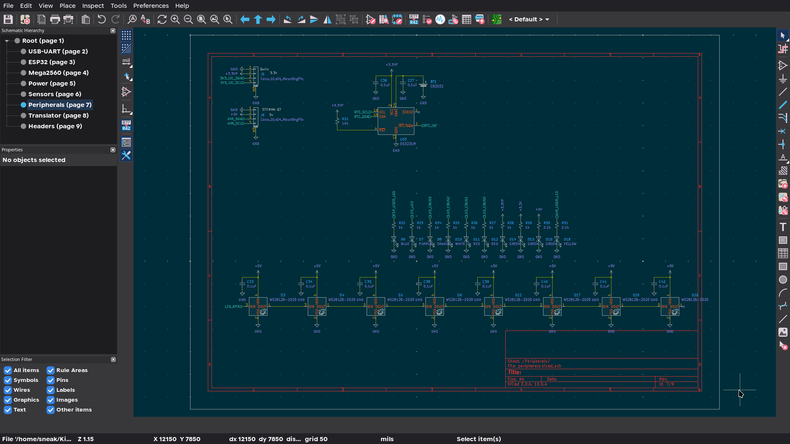
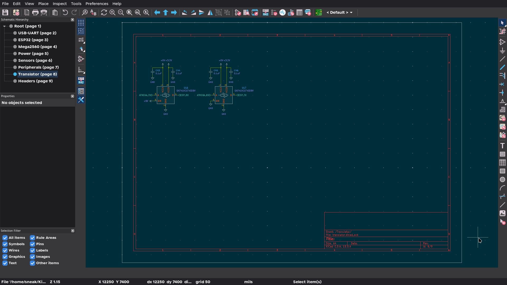
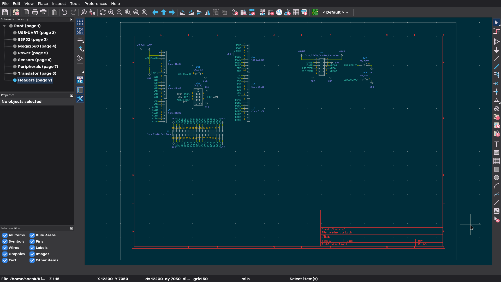

## How to use

It's an Arduino Mega with extras. Flash it like any Mega — the ATmega2560 programs over the USB-C port. The sensors and RTC sit on the I2C bus (SCL/SDA at pins 20/21) with different addresses:

| Device   | I2C Address |
|----------|-------------|
| BME680   | 0x76        |
| SCD41    | 0x62        |
| LSM6DSL  | 0x6A        |
| DS3231M  | 0x68        |

The ESP32-S3 connects to the Mega over UART (Serial1) through level translators, and handles WiFi/Bluetooth. It also reads the sensors over the same I2C bus.

## Assembly

1. Solder all SMD components, starting with the smallest packages (0402) and working up.
2. Solder the through-hole headers, connectors, and the USB-C receptacle.
3. Insert the CR2032 coin cell for RTC backup.
4. Power via USB-C or the barrel jack.

## Bill of Materials

A machine-generated `BOM.csv` lives in the repo root. Full list:

| Designators                    | Value                 | Package                    | Qty |
|--------------------------------|-----------------------|----------------------------|-----|
| BT1                            | CR2032                | Coin cell holder           | 1   |
| C1-C6,C8,C10,C13-C16,C28-C32,C36,C37 | 0.1uF           | 0402                       | 19  |
| C7                             | 10uF                  | 0402                       | 1   |
| C9,C43-C46                     | 0.1uF                 | 0805                       | 5   |
| C11,C12                        | 18pF                  | 0402                       | 2   |
| C17                            | 10uF                  | 0603                       | 1   |
| C18,C20,C21,C24,C25,C33-C35,C38-C42 | 0.1uF             | 0603                       | 13  |
| C19                            | 22uF                  | 0603                       | 1   |
| C22,C23,C26,C27                | 1uF                   | 0603                       | 4   |
| D1,D2                          | MBR0520               | SOD-123                    | 2   |
| D3-D5,D9,D13,D17,D19,D20       | WS2812B-2020          | PLCC-4 2.0x2.0mm           | 8   |
| D6-D11,D14-D18                 | Status LEDs           | 0402                       | 9   |
| F1,F2                          | 500mA polyfuse        | 1812                       | 2   |
| J1                             | USB-C receptacle      | HRO TYPE-C-31-M-12         | 1   |
| J2                             | 2x02 header           | PinSocket 2.54mm           | 1   |
| J3                             | microSD slot          | Hirose DM3D-SF             | 1   |
| J4                             | Barrel jack           | PJ-102AH                   | 1   |
| J5,J6                          | 1x04 JST-SH           | JST SH BM04B-SRSS-TB       | 2   |
| J7-J9,J13,J14                  | 1x08 header           | PinSocket 2.54mm           | 5   |
| J11                            | 2x18 header           | PinHeader 2.54mm           | 1   |
| J12                            | 1x10 header           | PinHeader 2.54mm           | 1   |
| J15                            | 2x06 header           | PinHeader 2.54mm           | 1   |
| L1                             | 2.2uH                 | Coilcraft XAL5030          | 1   |
| Q1                             | DMP3013SFV            | PowerDI3333-8              | 1   |
| R1,R3                          | 5.1k                  | 0402                       | 2   |
| R2,R4,R6,R7                    | 22                    | 0402                       | 4   |
| R5,R20                         | 10k                   | 0402                       | 2   |
| R8,R9                          | 4.7k                  | 0402                       | 2   |
| R10-R13,R15,R21                | 10k                   | 0603                       | 6   |
| R14                            | 10k                   | 0805                       | 1   |
| R16,R17                        | 4.7k                  | 0603                       | 2   |
| R18,R19                        | 100k                  | 0402 / 0603                | 2   |
| R22-R29                        | 1k                    | 0402                       | 8   |
| R30,R31                        | 2.2k                  | 0402                       | 2   |
| SW1                            | Reset switch          | PTS645Sx                   | 1   |
| SW2,SW3                        | Buttons               | TS-1088                    | 2   |
| U1,U3,U5                       | USBLC6 ESD protection | SOT-23-6                   | 3   |
| U2                             | FT231XS               | SSOP-20                    | 1   |
| U4                             | ESP32-S3-WROOM-1U-N16R8 | ESP32-S3 module        | 1   |
| U6                             | W25Q128JVS            | SOIC-8                     | 1   |
| U7                             | ATmega2560-16A        | TQFP-100                   | 1   |
| U8                             | FM24C64C              | SOIC-8                     | 1   |
| U9                             | TPS62163DSG           | WSON-8                     | 1   |
| U10,U11                        | TLV75733PDBV          | SOT-23-5                   | 2   |
| U12                            | SCD41-D-R2            | Sensirion SCD4x            | 1   |
| U13                            | BME680                | LGA-8                      | 1   |
| U14                            | LSM6DSL               | LGA-14                     | 1   |
| U15                            | DS3231M               | SOIC-16W                   | 1   |
| U16,U17                        | SN74LVC1T45DBV        | SOT-23-6                   | 2   |
| Y1                             | 16MHz crystal         | 3225-4Pin                  | 1   |

**Total cost: TBD**

## Firmware

Source lives in [firmware/](firmware/) as a PlatformIO project with two environments:

| Env | Target | What it does |
|-----|--------|--------------|
| `mega2560` | ATmega2560-16A | USB-UART (FT231XS), FM24C64C FRAM on I2C, Serial3 link to the ESP32 |
| `esp32s3` | ESP32-S3-WROOM-1U | Sensor reading (SCD41, BME680, LSM6DSL, DS3231M), SPI flash, NeoPixel status LEDs, WiFi/BT-ready |

Build with `pio run -e mega2560` and `pio run -e esp32s3`. The ESP32-S3 co-processor handles the sensors over its I2C1/SPI3 buses; the Mega keeps standard Arduino compatibility. See [firmware/README.md](firmware/README.md) for the full pin map.

## Known Issues

- None yet — board hasn't been fabbed. Expect some after the first build.

## Credits

- KiCad project files: [kicad/](kicad/)
- 3D models: Sensirion (SCD41), plus the WS2812B model referenced in the project
